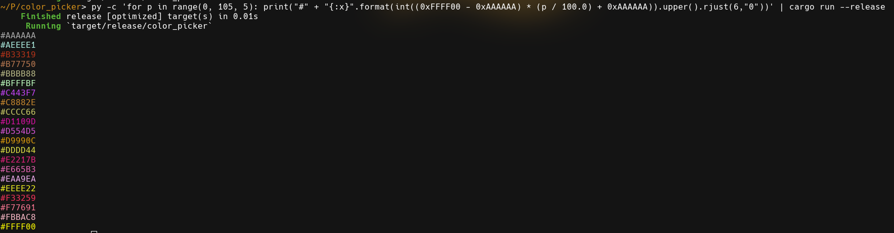

# Color Picker

A simple terminal color picker. Just pass it hexadecimal values through standard
input and it will color the hexadecimal values acording to their value.




## Instalation

### Cargo
```
cargo install color_picker
```
